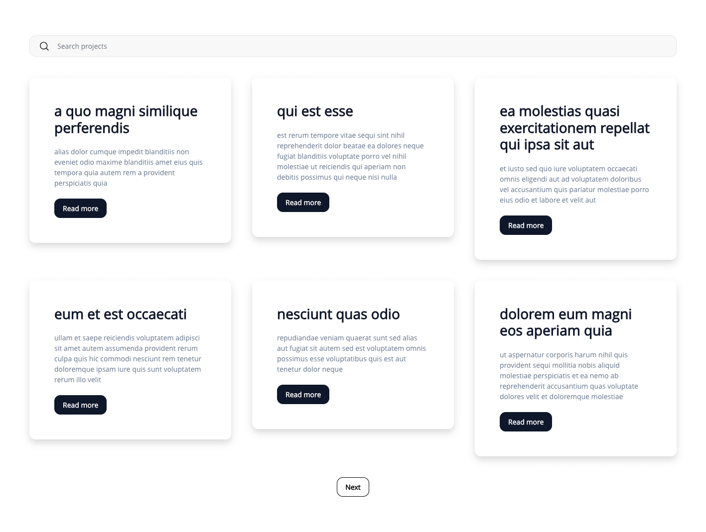

# ma-projects-plugin

### Descripción

Este plugin registra un custom post type llamado "Project".

En el momento de instalarlo se crearán 30 proyectos de ejemplo. El contenido de los mismos son extraídos de la API de [JSONPlaceholder](https://jsonplaceholder.typicode.com/).

### Uso

Se incluye un shortcode que muestra los proyectos acompañado de un buscador. El shortcode es el siguiente:

```
[mapp_posts]
```

